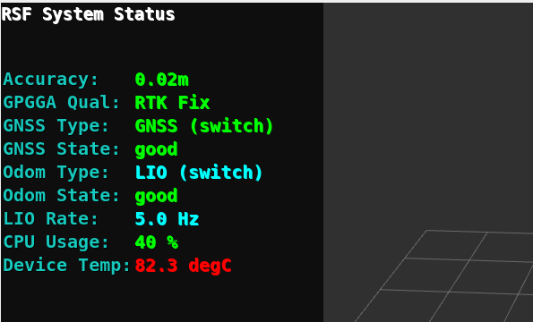

# hokuyo_rsf

Version: ROS2 humble

## セットアップ

### 依存パッケージの導入
```bash
# nmea_msgs (カスタム版が必要な場合)
git clone https://github.com/hokuyo-rd-release/nmea_msgs.git
```

### ビルド
```bash
cd ~/colcon_ws
colcon build --symlink-install --packages-select hokuyo_rsf
source install/setup.bash
```

## 実行

### 通常起動（全ノード）
```bash
ros2 launch hokuyo_rsf hokuyo_rsf_sample.launch.py
```

## rsf_state_debugger (オプション)
`rsf_state_debugger` (以降 debugger) パッケージを別途インストールすることで、
RViz 上にRSFの状態出力をリアルタイムで表示させることができます。



### rsf_state_debugger のインストール手順

```bash
# jsk_visualization のクローン
cd ~/colcon_ws/src
git clone https://github.com/hokuyo-rd-release/jsk_visualization.git
colcon build
source install/setup.bash
```

### debugger を起動する (hokuyo_rsf を起動する)：
```bash
ros2 launch hokuyo_rsf hokuyo_rsf_sample.launch.py show_debugger:=true
```

### debugger のみを確認する（hokuyo_rsfを起動しない）：
```bash
ros2 launch hokuyo_rsf hokuyo_rsf_sample.launch.py show_debugger:=true debugger_only:=true
```

### ステータス項目一覧
| 項目名 | 説明 | 参照トピック | 詳細説明 |
| :--- | :--- | :--- | :--- |
| **Accuracy** | 推定される GNSS 位置精度（m）。 | `/rsf/nav_sat_fix` | **緑**: ≤0.1m, **黄**: ≤0.5m, **赤**: >1.5m |
| **GPGGA Qual** | NMEA形式の測位情報 | `/rsf/gpgga` | **緑**: RTK Fix(4), **黄**: RTK Float(5), **シアン**: GPS/DGPS(1,2), **赤**: Invalid/Estimated(0,6) |
| **GNSS Type** | 測位データのソース。 | `/rsf/rsf_fix_type` | **緑**: GNSS (switch), **水色**: LIO (switch), **黄**: GNSS raw, **赤**: abnormal |
| **GNSS State** | 測位計算の収束状態。 | `/rsf/rsf_fix_state` | **緑**: good/normal, **黄**: be careful, **赤**: abnormal |
| **Odometry Type** | 現在の主オドメトリソース。 | `/rsf/rsf_odom_type` | **緑**: GNSS (switch), **水色**: LIO (switch), **黄**: LIO raw, **赤**: abnormal |
| **Odometry State** | システムの動作・安定状態。 | `/rsf/rsf_odom_state` | **緑**: good/normal, **黄**: be careful, **赤**: abnormal |
| **LIO Rate** | 直近1000サンプルの平均周波数。 | `/rsf/lio_lidar_rate_odom` | **シアン** |
| **CPU Usage** | システム全体の CPU 使用率。 | `/rsf/diagnostics` | **緑**: < 70%, **黄**: < 90%, **赤**: 90% 超過 |
| **Device Temp** | センサー内部のcpu温度。 | `/rsf/diagnostics` | **緑**: < 60℃, **黄**: < 70 ℃, **赤**: 70℃ 超過 |

### アラート通知

#### 1. ビジュアルアラート
重大な異常を検知した際、RViz 画面中央に赤色の大きなテキストが表示されます。
- **!!! HIGH CPU LOAD !!!**: CPU 使用率が `cpu_limit`（デフォルト 90%）を超過。
- **!!! DEVICE OVERHEAT !!!**: 温度が `temp_limit`（デフォルト 70.0℃）を超過。

#### 2. 音声警告 (audio_warning_player)
以下のイベントが発生した際、`/rsf/audio_warning` トピックを介して
スピーカーから音声ファイルを再生します。

**主なイベントと対応ファイル:**
- `cpu_overload` / `cpu_normal`
- `temperature_error` / `temperature_normal`
- `gnss_lost` / `gnss_recovered`

**依存関係**
`aplay` を使用します。
```
sudo apt install alsa-utils
```
- **音声ファイル配置先**: `rsf_debugger` パッケージ内の `sounds/` ディレクトリ。
- **パラメータ**: 
  - `sub_topic`: 購読するトピック名（デフォルト: `/rsf/audio_warning`）。環境に合わせて変更可能です。

**カスタマイズ:**
独自の音声を追加したい場合は、新しい `.wav` ファイルを `sounds/` ディレクトリに配置し、そのファイル名（拡張子抜き）をトピックにパブリッシュすることで即座に再生可能です。

### 自律走行サンプル

解説：https://sourceforge.net/p/urgnetwork/wiki/rsf_app_info_jp/

出力仕様に関する解説：https://sourceforge.net/p/urgnetwork/wiki/rsf_spec_info_jp/

ソース：https://github.com/Hokuyo-aut/hokuyo_navigation2